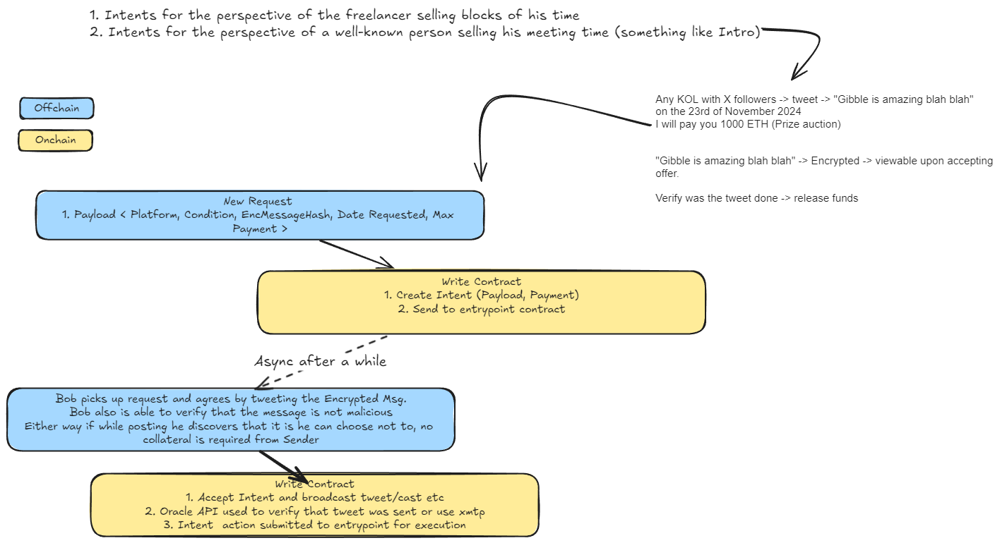

<h4 align="center">
  <!-- <a href="https://docs.scaffoldeth.io">Documentation</a> | -->
  <a href="https://cario.lol">Website</a>
</h4>




1. https://testnet-scan.sign.global/attestation/onchain_evm_84532_0x41b -> Eth Sign Test Done
2. Chainlink Function call works -> Tested -> https://functions.chain.link/base-sepolia/164#/side-drawer/base-sepolia/164/0xccaee949129a04eae34fb9100c519bd988b78f908bb878682b11fb8e9ee9953f
3. Integration
4. Add ZK/Fenix for messages


## Deployments
0xe3BE1b9818Cd42029e5eeD010Bcf2EdaFF9e82B0 -> SignProtocolIssuer.sol
0x8AF4091AE8cEedE7cb6dC47B9829124d2a48fa6A -> Cario Intent.sol

🧪 An open-source, up-to-date toolkit for building decentralized applications (dapps) on the Ethereum blockchain. It's designed to make it easier for developers to create and deploy smart contracts and build user interfaces that interact with those contracts.

⚙️ Built using NextJS, RainbowKit, Foundry, Wagmi, Viem, and Typescript.

- ✅ **Contract Hot Reload**: Your frontend auto-adapts to your smart contract as you edit it.
- 🪝 **[Custom hooks](https://docs.scaffoldeth.io/hooks/)**: Collection of React hooks wrapper around [wagmi](https://wagmi.sh/) to simplify interactions with smart contracts with typescript autocompletion.
- 🧱 [**Components**](https://docs.scaffoldeth.io/components/): Collection of common web3 components to quickly build your frontend.
- 🔥 **Burner Wallet & Local Faucet**: Quickly test your application with a burner wallet and local faucet.
- 🔐 **Integration with Wallet Providers**: Connect to different wallet providers and interact with the Ethereum network.


## Requirements

Before you begin, you need to install the following tools:

- [Node (>= v18.17)](https://nodejs.org/en/download/)
- Yarn ([v1](https://classic.yarnpkg.com/en/docs/install/) or [v2+](https://yarnpkg.com/getting-started/install))
- [Git](https://git-scm.com/downloads)

## Quickstart

To get started with Cario, follow the steps below:

1. Install dependencies if it was skipped in CLI:

```
cd my-dapp-example
yarn install
```

2. Run a local network in the first terminal:

```
yarn chain
```

This command starts a local Ethereum network using Foundry. The network runs on your local machine and can be used for testing and development. You can customize the network configuration in `packages/foundry/foundry.toml`.

3. On a second terminal, deploy the test contract:

```
yarn deploy
```

This command deploys a test smart contract to the local network. The contract is located in `packages/foundry/contracts` and can be modified to suit your needs. The `yarn deploy` command uses the deploy script located in `packages/foundry/script` to deploy the contract to the network. You can also customize the deploy script.

4. On a third terminal, start your NextJS app:

```
yarn start
```

Visit your app on: `http://localhost:3000`. You can interact with your smart contract using the `Debug Contracts` page. You can tweak the app config in `packages/nextjs/scaffold.config.ts`.

Run smart contract test with `yarn foundry:test`

- Edit your smart contract `CarioIntent.sol` in `packages/foundry/contracts`
- Edit your frontend homepage at `packages/nextjs/app/page.tsx`. For guidance on [routing](https://nextjs.org/docs/app/building-your-application/routing/defining-routes) and configuring [pages/layouts](https://nextjs.org/docs/app/building-your-application/routing/pages-and-layouts) checkout the Next.js documentation.
- Edit your deployment scripts in `packages/foundry/script`